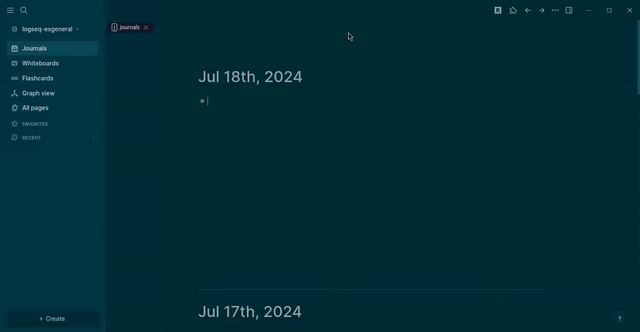

## Generic Fetch Plugin

This is my first plugin for logseq.
I wanted a terminal but that cannot be implemented right now so instead I created a simple fetch tool.

This plugin requires xterm for a fully functional terminal.
### Demo

### Running the Sample

- `npm install`
- `Load unpacked plugin` in Logseq Desktop client.

### Known issues
For some reason xterm.focus() and related don't focus on the terminal.

After Ctrl+I the cursor is in the editor window and you have to click the terminal to get it back.

The plugin frame blocks the Editor window and I feel like there's a way to be able to use the terminal and the editor window at the same time...

